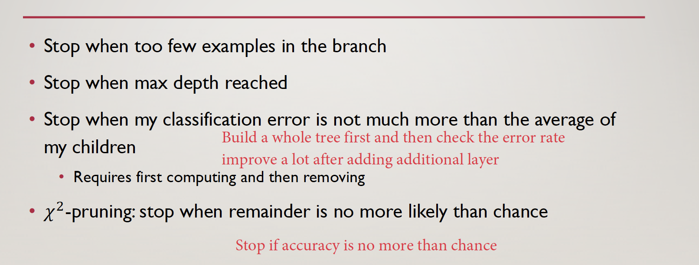

# Model

- Loss Function 

  need to be non-negative

  0 = perfect prediction

- No Free Lunch Theorem

  > No single model that works best!
  >
  > Model makes assumptions!

- Model Selection

  - Cross-validation

  - Bayesian model selection

    $P(m|D) = \frac{P(D|m_0)}{P(D|m_1)} * \frac{P(m_0)}{P(m_1)}$ (Usually same prior)

- Bias-Variance Tradeoff

  - Bias: error from mean 
  - Variance: spread around center

- Bayesian Information Criterion (BIC)

  $BIC = DOF(\theta)log N - 2logP(D|\theta)$ : penalise high DOF model, mitigated by its likelyhood 

# Linear Regression

- Assumptions:

  1. Linearity: data is linear
  2. Independence of error: data is IDD sampled 
  3. Residue(error) is Gaussian
  4. Equal variance of errors

- Loss Function: 

  - Based on Gaussian Error 
  - MSE 

- Optimization (Solution):

  - Derivation of close form solution $(X^TX)^{-1}X^Ty$

- Gaussian MLE always biased: $E[\sigma^2] = \frac{n-1}{n} \sigma^2$
  Smaller than the true error. Because we measure from sample 

- Expectation of Error = bias * bias + variance

- Regularization

  - More regularization -> high bias term -> more bias

  - Less regularization -> more overfitting -> more variance

    ​

# KNN

- Idea: choose class based on K nearst neighbor 

- Caveats:

  - Need to normalise vector

- Model Complexity:

  - K too small: overfitting 

  - K too high: underfit

    ​

# Logistic Regression

- Idea: $p(y=1|x) = \frac{1}{1 + e^{- w^T x}} y \in \{0, 1\}$
- Why not use Linear Regression for Classification?
  - Ans: Classification does not care about the magnitude of loss, outlier will hur linear regression for classification badly.
- Derivation
  - odds of two class $\frac{P(y=1|x)}{P(y=0|x)} = e^{w^Tx}$
  - then we have $\frac{p}{1-p} = e^{w^Tx}$
  - solve for $p$
- Loss function:
  - LIkelyhood function: MLE of every data $\sum log[y_i P(y=1|x_i) + (1-y_i)P(y_i=0|x_i)]$
- Optimization:
  - Gradient: $-\sum(y_i-p(y_i|x_i, w_i)) x_i$
  - Gradient Ascent
    - SGD or Batch or Whole Data

# Perceptron

- Idea: $y = sign(w^Tx) y \in \{-1,1\}$
-  Loss function: 
  - 1 loss if incorrect, 0 otherwise
  - or $L = max(0, -y_iw^Tx_i)$
- Optimization:
  - Gradient: 
    - $\nabla L=0$ if $y_iw^Tx_i > 0$, else $-y_ix_i$
  - Weight Update:
    - $w^{i+1} = w^{i} + \eta (y_i - \hat{y}_i)x_i$
- Online-Learning vs. Batch Learning
  - Assumptions behind `batch learning`:
    - **one optimal hypothesis fits all of the data**
    - data are IID
    - Advantage:
      - Guarentee convergency
  - Online Learning:
    - No train-test data split. Infinite data steam
    - **No consistency in hypothesis**
    - Advantage
      - Handle large data
      - Faster for lots of data

# SVM

- Idea: find the best plane that separate data by maximise the margin to each of example

- Derivation (highly recommend reading: [Stanford CS229 Notes](http://cs229.stanford.edu/notes/cs229-notes3.pdf))
  - Functional Margin: $\hat{\gamma}_i =y_i (w^Tx_i + b)$

  - Geometric Margin (norm of vector AB), and it satisfy following function
     $\gamma \dot{\frac{W}{||w||}} = A - B$. Also since $B$ is on the decision boundary, $w^TB = 0$, we can derive geo margin $\gamma_i = y_i [(\frac{w}{||w|})^T x_i + \frac{b}{||w||}]$
      We can see that if $||w|| = 1$, then $\gamma = \hat{\gamma}$, which implies $\frac{\hat{\gamma}}{\gamma} = ||w||$
      ​
      ​

  - 

  - Therefore, our objective is to:

    > max $\gamma$, s.t. $y_i (w^Tx_i + b) \geq \gamma, \forall i$ and $||w||=1$

    Then, since $\frac{\hat{\gamma}}{\gamma} = ||w||$, we can rewrite objective function to:

    > max $\frac{\hat{\gamma}}{||w||}$, s.t. $y_i (w^Tx_i + b) \geq \hat{\gamma}, \forall i$

    Finally, since maximise max $\frac{\hat{\gamma}}{||w||}$ is equivalent to min $\frac{1}{2}||w||^2$, and $\hat{\gamma}$ can be arbitrarily scaled, we set $\hat{\gamma} = 1$, then we have

    > max $\frac{1}{2}||w||^2$, s.t. $y_i (w^Tx_i + b) \geq 1, \forall i$

- Loss function

  - Hinge Loss: $max(0, 1-y \dot{} wx)$

## SVM Duality

- Dual vs Primal max (Please refer to Andrew Ng CS299 notes)

  

  - Note $w = \sum [a_iy_ix_i]$ and only some of $a_i$ are non-zero, which are the support vector

- Slack Variable

  - Add regulariser term $min_w 1/2 ||w||^2 + C\sum \epsilon_i$ s.t $(w^Tx_i)y_i + \epsilon_i \geq 1$
  - Larger C means more penalty on slack the maring
    - Better fit to data. More overfitting.

- New Prediction for test data $x_j$ is given by $x_j^T\dot{}w = x_j^T\sum[a_iy_ix_i] = \sum a_iy_i(x^T_j x_i)$

## Kernel

- How to use kernel?

  1. Feature mapping: $\phi(x)$ to higher dimension to make data linearly separable. e.g $\phi(x)=[x_{(1)}^2, \sqrt{2}x_{(1)}x_{(2)}, x^2_{(2)}]$

     In primal form, we need to learn $w$ for each feature, which could be very large

     While in dual form, we don't have $w$

  2. We can use $\phi(x)$ instead of $x$ in our computation in order to learn non-linear boundary.

  

  3. Then we can define Kernel $K(x, x') = \phi(x)^T\phi(x')$. 

     Why we want to define it as kernel? Because we can often have simpler solution to Kernel without actually computing the $\phi$ in a possibly very high dimension

     

     For example above, we **don't** need to actually compute the inner product of $\phi(x)$, which is $(x^2_{1}x'^2_{(1)} + …… + 2x_{(1)}x_{(2)}x'_{(1)}x'_{(2)})$
     All we need to compute is $(x \dot{} x')^2$

     ​

- Kernel as similarity Function

  

- What qualify a Kernel?

  - You can decompose it into $\phi(x)^T\phi(x')$
  - Or it satisfy Mercer's Theorem : kernel matrix is symmetric positive semi-definite
    - Kernel Matrix $\mathbf{K}_{ij} = \mathbf{K}_{ji}$
    - $\mathbf{x}^TK\mathbf{x} \geq 0, \forall\mathbf{x} \in R^m$

- Kernel formation

  

- Gaussian Kernel

  

  Larger $\sigma$ means the support vector has greater influence area

- Summary

  - Good
    - Arbitrarily high dimension
    - Extension to other data types
    - Non-linearity
  - -Bad
    - Choose kernel is not easy
    - Can not handle large data

# Decision Tree

- ID3 Algorithm

  

  - Terminating when:
    - All data has same label
    - Unseen example or feature value
    - No further splits possible (run out of splitting feature or feature value for data are the same, but somehow label are not)

- IG and Entropy

  

- Overfitting and Underfitting

  - Overfitting: complete tree remembers every data
  - Underfitting: one level tree returns majority label

- Tree Pruning 

  

- Summary

  

# Ensemble Method

## Random Forrest

-  Data Sampling: With dataset of size N, create M different samples of size N by resampling wit replacement
  - Bootstrapping and Bagging
-  Feature Sampling: random subset of feature at each node

## AdaBoost

- Idea: weighted combined decision for weak learners

- Algorithm:

  

  

  - Note:
    1. Loss function is different for different classifier
    2. $a_m$ increases as error rate decreases, giving this classifier more weight in the final product

- Why AdaBoos t is not prune to over-fittting

  1. Implicit L1 regularization through stopping at a finite number of weak learners
  2. AdaBoost continues to maximize the margin, leading to better generalization (this yields the similarities with SVMs)

- AdaBoost is able to find better margin even though it training error goes down fast.

  - Other practical Advantages
    - Not prune to over-fitting
    - Fast
    - Easy to implement
    - No parameter tunning 
    - Not specific to any weak learner
    - Well-motivated by learning theory
    - Can identify outliers

## Diversity and Weighted Experts

- Idea: Diversity in classifiers, datasets
  - Data diversity: feature/instance bagging

# Neural Net

- Two layer NN classification

  - $y_k(x, w) = \sigma(\sum_j^M w_{kj}[h(\sum_{i}^D w_{ji}x_i)+w_{j0}] + w_{k0})$

    Where D is number of input;

    M is number of hidden layer neurones

    K is number of classes

    $\sigma$ Is sigmoid function

    $h$ Is a non-linear activation function

- Loss function:

  - Cross Entropy for classification: [Cross entropy](https://en.wikipedia.org/wiki/Cross_entropy) is the number of bits we'll need if we encode symbols from yy using the *wrong* tool ŷ 

    

    - Sidenotes: KL divergence is just the difference between cross and entropy

  - OLS  

- Optimisation:

  - Gradient descent 
  - Back propagation: Chain rule of derivation through computation graph.

###Problems with NN:

1. Required Large Labelled Data otherwise easy to overfit.
2. Non-convex objective -> easy stuck in local optima
3. "Vanishing Gradient": as gradient propagate back, gradient become even smaller

### How To Solve?

- Idea1: Back-propragate + SGD -> not always work

- Idea 2: Supervised Pre-training

  - Iteratively add hidden layer. Train current hidden layer with previous hidden layer fixed
  - Then train once together

- Idea 3: Unsupervised Pre-training via Auto-Encoder

  - Auto-encoder: learn input structure by training to encoding input.

  - Better than idea 2 because it is trying to perform a different task: learning the structure in the data which can resulting in a better starting point

    