# Metrics

- Classification

  - Accuracy: true_positive + true_negative

  - Recall/Precision/F. F1 is balance between recall and precision

  - NegativeLogLikelyhood 

  - Area Under ROC Curve(AUC) for binary classification

    he AUC for a classifier with no power, essentially random guessing, is 0.5, because the curve follows the diagonal. The AUC for that mythical being, the perfect classifier, is 1.0. Most classifiers have AUCs that fall somewhere between these two values.

    True Positive Rate/False Positive

  - Confusion Matrix

- Regression

  - Mean Absolute Error

  - Mean Square Error. It gives more punishment for large error

  - R^2 (R Sqaure): it is the percentage of the response variable variation that is explained by a linear model. 

    $R-squared =Explained variation / Total variation$

# Model

- Loss Function 

  need to be non-negative

  0 = perfect prediction

- No Free Lunch Theorem

  > No single model that works best!
  >
  > Model makes assumptions!

- Model Selection

  - Cross-validation

  - Bayesian model selection

    $P(m|D) = \frac{P(D|m_0)}{P(D|m_1)} * \frac{P(m_0)}{P(m_1)}$ (Usually same prior)

- Bias-Variance Tradeoff

  - Bias: error from mean 
  - Variance: spread around center

- Bayesian Information Criterion (BIC)

  $BIC = DOF(\theta)log N - 2logP(D|\theta)$ : penalise high DOF model, mitigated by its likelyhood 

# Linear Regression

- Assumptions:

  1. Linearity: data is linear
  2. Independence of error: data is IDD sampled 
  3. Residue(error) is Gaussian
  4. Equal variance of errors

- Loss Function: 

  - Based on Gaussian Error 
  - MSE 

- Optimization (Solution):

  - Derivation of close form solution $(X^TX)^{-1}X^Ty$

- Gaussian MLE always biased: $E[\sigma^2] = \frac{n-1}{n} \sigma^2$
  Smaller than the true error. Because we measure from sample 

- Expectation of Error = bias * bias + variance

- Regularization

  - More regularization -> high bias term -> more bias

  - Less regularization -> more overfitting -> more variance

    

# KNN

- Idea: choose class based on K nearst neighbor 

- Caveats:

  - Need to normalise vector

- Model Complexity:

  - K too small: overfitting 

  - K too high: underfit

    

# Logistic Regression

- Idea: $p(y=1|x) = \frac{1}{1 + e^{- w^T x}} y \in \{0, 1\}$
- Why not use Linear Regression for Classification?
  - Ans: Classification does not care about the magnitude of loss, outlier will hur linear regression for classification badly.
- Derivation
  - odds of two class $\frac{P(y=1|x)}{P(y=0|x)} = e^{w^Tx}$
  - then we have $\frac{p}{1-p} = e^{w^Tx}$
  - solve for $p$
- Soft-max interpretation
  - $\frac{e^{G(x)}}{e^{G(x)} + e^{0}}$
- Loss function:
  - LIkelyhood function: MLE of every data $\sum log[y_i P(y=1|x_i) + (1-y_i)P(y_i=0|x_i)]$
- Optimization:
  - Gradient: $-\sum(y_i-p(y_i|x_i, w_i)) x_i$
  - Gradient Ascent
    - SGD or Batch or Whole Data

# Perceptron

- Idea: $y = sign(w^Tx) y \in \{-1,1\}$
-  Loss function: 
  - 1 loss if incorrect, 0 otherwise
  - or $L = max(0, -y_iw^Tx_i)$
- Optimization:
  - Gradient: 
    - $\nabla L=0$ if $y_iw^Tx_i > 0$, else $-y_ix_i$
  - Weight Update:
    - $ w^{i+1} = w^{i} + \eta (y_i - \hat{y}_i)x_i$, ($y-\hat{y_i} $ is either 2 or -2)
- Online-Learning vs. Batch Learning
  - Assumptions behind `batch learning`:
    - **one optimal hypothesis fits all of the data**
    - data are IID
    - Advantage:
      - Guarentee convergency
  - Online Learning:
    - No train-test data split. Infinite data steam
    - **No consistency in hypothesis**
    - Advantage
      - Handle large data
      - Faster for lots of data

# SVM

- Idea: find the best plane that separate data by maximise the margin to each of example

- Derivation (highly recommend reading: [Stanford CS229 Notes](http://cs229.stanford.edu/notes/cs229-notes3.pdf))

  - Functional Margin: $\hat{\gamma}_i =y_i (w^Tx_i + b)$

  - Geometric Margin (norm of vector AB), and it satisfy following function
     $\gamma \dot{\frac{W}{||w||}} = A - B$. Also since $B$ is on the decision boundary, $w^TB = 0$, we can derive geo margin $\gamma_i = y_i [(\frac{w}{||w|})^T x_i + \frac{b}{||w||}]$
      We can see that if $||w|| = 1$, then $\gamma = \hat{\gamma}$, which implies $\frac{\hat{\gamma}}{\gamma} = ||w||$
      ​
      ​

  - 

  - Therefore, our objective is to:

    > max $\gamma$, s.t. $y_i (w^Tx_i + b) \geq \gamma, \forall i$ and $||w||=1$

    Then, since $\frac{\hat{\gamma}}{\gamma} = ||w||$, we can rewrite objective function to:

    > max $\frac{\hat{\gamma}}{||w||}$, s.t. $y_i (w^Tx_i + b) \geq \hat{\gamma}, \forall i$

    Finally, since maximise max $\frac{\hat{\gamma}}{||w||}$ is equivalent to min $\frac{1}{2}||w||^2$, and $\hat{\gamma}$ can be arbitrarily scaled, we set $\hat{\gamma} = 1$, then we have

    > max $\frac{1}{2}||w||^2$, s.t. $y_i (w^Tx_i + b) \geq 1, \forall i$

- Loss function

  - Hinge Loss: $max(0, 1-y \dot{} wx)$

## SVM Duality

- Dual vs Primal max (Please refer to Andrew Ng CS229 notes)

  

  - Note $w = \sum [a_iy_ix_i]$ and only some of $a_i$ are non-zero, which are the support vector

- Slack Variable

  - Add regulariser term $min_w 1/2 ||w||^2 + C\sum \epsilon_i$ s.t $(w^Tx_i)y_i + \epsilon_i \geq 1$
  - Larger C means more penalty on slacking the margin
    - Better fit to data. More overfitting.

- New Prediction for test data $x_j$ is given by $x_j^T\dot{}w = x_j^T\sum[a_iy_ix_i] = \sum a_iy_i(x^T_j x_i)$

## Kernel

- How to use kernel?

  1. Feature mapping: $\phi(x)$ to higher dimension to make data linearly separable. e.g $\phi(x)=[x_{(1)}^2, \sqrt{2}x_{(1)}x_{(2)}, x^2_{(2)}]$

     In primal form, we need to learn $w$ for each feature, which could be very large

     While in dual form, we don't have $w$

  2. We can use $\phi(x)$ instead of $x$ in our computation in order to learn non-linear boundary.

  

  3. Then we can define Kernel $K(x, x') = \phi(x)^T\phi(x')$. 

     Why we want to define it as kernel? Because we can often have simpler solution to Kernel without actually computing the $\phi$ in a possibly very high dimension

     

For example above, we **don't** need to actually compute the inner product of $\phi(x)$, which is $(x^2_{1}x'^2_{(1)} + …… + 2x_{(1)}x_{(2)}x'_{(1)}x'_{(2)})$,  All we need to compute is $(x \dot{} x')^2$

- Kernel as similarity Function

  

- What qualify a Kernel?

  - You can decompose it into $\phi(x)^T\phi(x')$
  - Or it satisfy Mercer's Theorem : kernel matrix is symmetric positive semi-definite
    - Kernel Matrix $\mathbf{K}_{ij} = \mathbf{K}_{ji}$
    - $\mathbf{x}^TK\mathbf{x} \geq 0, \forall\mathbf{x} \in R^m$

- Kernel formation

  

- Gaussian Kernel

  

  Larger $\sigma$ means the support vector has greater influence area

- Summary

  - Good
    - Arbitrarily high dimension
    - Extension to other data types
    - Non-linearity
  - -Bad
    - Choose kernel is not easy
    - Can not handle large data

# Decision Tree

- ID3 Algorithm

  

  - Terminating when:
    - All data has same label
    - Unseen example or feature value
    - No further splits possible (run out of splitting feature or feature value for data are the same, but somehow label are not)

- IG and Entropy

  

- Overfitting and Underfitting

  - Overfitting: complete tree remembers every data
  - Underfitting: one level tree returns majority label

- Tree Pruning 

  

- Summary

  

# Ensemble Method

## Boosting and Bagging:

Both are ensemble methods to one strong model based on many weak learners.

- Bagging: 

  - Method: data resample + feature downsample

- Boosting:

  - Method: Learners are learned sequentially . Learners will adjust the way they learn based on earlier learner's error. 

  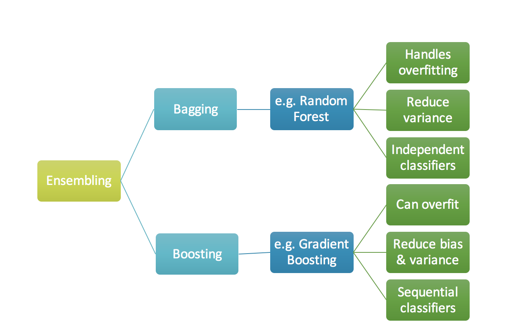

## Random Forrest

- Data Sampling: With dataset of size N, create M different samples of size N by resampling wit replacement
  - Bootstrapping and Bagging:

- Feature Sampling: random subset of feature at each node

- Pros:  

  1. Handles higher dimensionality data very well.

  2. Handles missing values and maintains accuracy for missing data.

-  Cons:

   1. Greedy training
   2. Inaccurate due to majority voting

## AdaBoost

- Idea: weighted combined decision for weak learners

- Algorithm:

  

  

  - Note:
    1. Loss function is different for different classifier
    2. $a_m$ increases as error rate decreases, giving this classifier more weight in the final product

- Why AdaBoos t is not prune to over-fittting

  1. Implicit L1 regularization through stopping at a finite number of weak learners
  2. AdaBoost continues to maximize the margin, leading to better generalization (this yields the similarities with SVMs)

- AdaBoost is able to find better margin even though it training error goes down fast.

  - Other practical Advantages
    - Not prune to over-fitting
    - Fast
    - Easy to implement
    - No parameter tunning 
    - Not specific to any weak learner
    - Well-motivated by learning theory
    - Can identify outliers

## Diversity and Weighted Experts

- Idea: Diversity in classifiers, datasets
  - Data diversity: feature/instance bagging

## Gradient Boosting

- Intuition:  `gradient boosting` algorithm is to repetitively leverage the patterns in residuals and strengthen a model with weak predictions and make it better. Once we reach a stage that residuals do not have any pattern that could be modeled, we can stop modeling residuals (otherwise it might lead to overfitting). Algorithmically, we are minimizing our loss function, such that test loss reach its minima.

# Neural Net

- Two layer NN classification

  - $y_k(x, w) = \sigma(\sum_j^M w_{kj}[h(\sum_{i}^D w_{ji}x_i)+w_{j0}] + w_{k0})$

    Where D is number of input;

    M is number of hidden layer neurones

    K is number of classes

    $\sigma$ Is sigmoid function

    $h$ Is a non-linear activation function

- Loss function:

  - Cross Entropy for classification: [Cross entropy](https://en.wikipedia.org/wiki/Cross_entropy) is the number of bits we'll need if we encode symbols from yy using the *wrong* tool ŷ 

    

    - Sidenotes: KL divergence is just the difference between cross and entropy

  - OLS  

- Optimisation:

  - Gradient descent 
  - Back propagation: Chain rule of derivation through computation graph.

###Problems with NN:

1. Required Large Labelled Data otherwise easy to overfit.
2. Non-convex objective -> easy stuck in local optima
3. "Vanishing Gradient": as gradient propagate back, gradient become even smaller

### How To Solve?

- Idea1: Back-propragate + SGD -> not always work

- Idea 2: Supervised Pre-training

  - Iteratively add hidden layer. Train current hidden layer with previous hidden layer fixed
  - Then train once together

- Idea 3: Unsupervised Pre-training via Auto-Encoder

  - Auto-encoder: learn input structure by training to encoding input.

  - Better than idea 2 because it is trying to perform a different task: learning the structure in the data which can resulting in a better starting point

    

### Non-linear Activation Functions

- Sigmoid: $\frac{1}{1+e^{-u}}$ [0, 1]
- Tanh: [-1, 1]
- ReLU: $max(0, w*x+b)$. Cap at zero.  Faster, no gradient saturation problem like Sigmoid or Tanh for large values (nearly flat curve at the very left or very right on plot)
  - Variations
    1. Leaky ReLU: if $ x > 0, f(x)=  x$, else $f(x)=ax (0<a<1)$
    2. Smoothed ReLU: $log(exp(x)+1)$. (Notice $log(exp(x))=x$))
  - 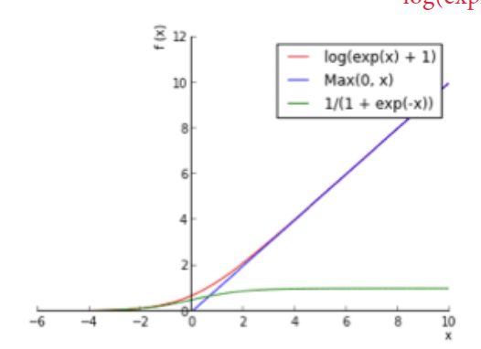

## Techniques to Avoid Overfitting

1. Regularization: L1 or L2 on $W$

2. Early Stopping: Stop training when held-out accuracy no longer improves

3. **Dropout**: Randomly drop neural and their connections in training process;  in testing, use full networks but with weights scaled by the probability that they were present during training. 

   But why Dropout works?

   Answer: 

    	1. Dropout is similar to making random perturbations in the input -> reduce variance
   	2. Prevents neuron co-adaptation. Neurons take values rely on other neurons for correct prediction
   	3. Works like ensemble training. 

# Other Topics

## Transfer Learning

Pretrain ConvNet with a large dataset and then use it as one of following 3 ways:

 	1. **ConvNet as fixed feature extractor**. Remove last layer fo ConvNet and use the output of the last hidden layer(firstly pass through ReLu function if in original ConvNet there is ReLU ). Then use the output as features to feed SVM or SoftMax or other ML models
	2. **Fine-Tune the on new dataset**. It is possible to fine-tune all the layers of the ConvNet, or it’s possible to keep some of the earlier layers fixed (due to overfitting concerns) and only fine-tune some higher-level portion of the network. This is motivated by the observation that the earlier features of a ConvNet contain more generic features .
	3. **Pretrained models**. Since modern ConvNets take 2-3 weeks to train across multiple GPUs on ImageNet, it is common to see people release their final ConvNet checkpoints for the benefit of others who can use the networks for fine-tuning. 

More to look at http://cs231n.github.io/transfer-learning/

## Clustering 

Two parameter overall:

$\mu_k$ : cluster center. Defined by mean of examples in that cluster

$r_{nk}$ : whether $nth$ data is in $kth$ cluster

### K-Means

1. Select $r$ that minimizes J with fixed $\mu$
2. Select $\mu$ that minimizes J with fixed $r$

Problems:

- Slow: O(TKNM), where T is number of iteration, K is number of clusters, N is number of data, M is vector dimension(due to calculate distance of data to $\mu$)
- Hard decision boundary -> Gaussian Mixture Model

### GMM

Assume each example is generated by a mixture of Gaussian distributions.

We still have two set of parameters:

1. $\pi_{k}$ = prior of this Gaussian, $\mu_k$ and $\sigma_k$ (mean and covariance of Gaussian)
2. $r_{nk}$

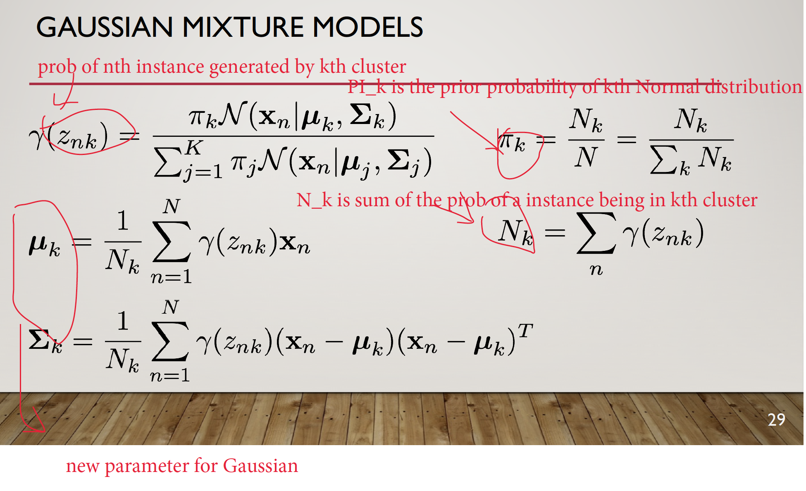

Problem:

- Slower than K-Mean: more iteration to converge and more expensive in each iteration
- Mode-Collapse: one data is isolated and become its own Gaussian
- Very non-convex likelyhood

# EM

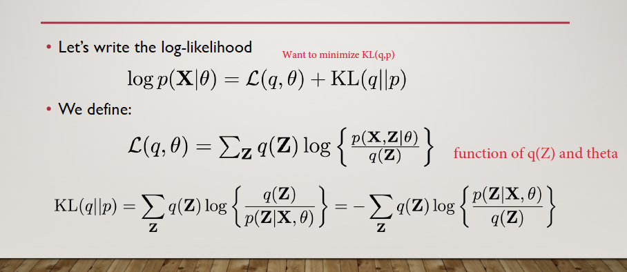

Note:

- $\mathcal{L}(q,\theta)$ Is a function of $q$ and $\theta$. 
- $KL(q||p)$ Measures the distribution difference in $q(Z)$ and $
- This equation is able to be proved

## E-step

In E step, we fix $\theta$, and let it be $\theta^{old}$ .   

We will try to maximise the lower bound of $\log p(X|\theta)$, which is $\mathcal{L}$.

Since likelihood of $p(X|\theta)$ is only depend on $\theta$, it is a constant in this step.  Keeping $\log p(X|\theta)$ Constant, if we minimise $KL(q||p)$ by changing $q(Z)$, $\mathcal{L}(q, \theta)$ has to increase.  Therefore, the likelihood of our approximate distribution $q(Z)$ will increase when $KL(q||p)$ is minimised when $q(Z)=p(Z|X, \theta^{old})$. 

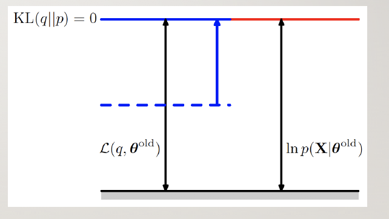

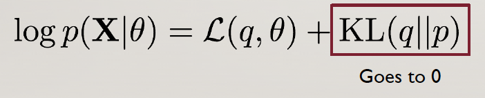

##M-step

In M step, we fix $q(Z)$.

We will still try to maximise the lower bound of $\log p(X|\theta)$, which is $\mathcal{L}$. But this time,  $\log p(X|\theta)$ is not a constant. 

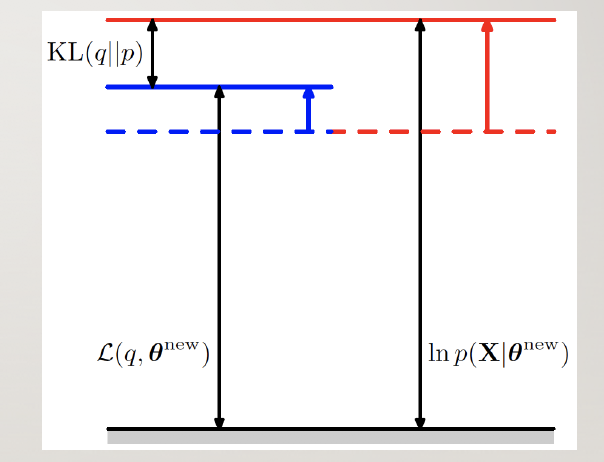

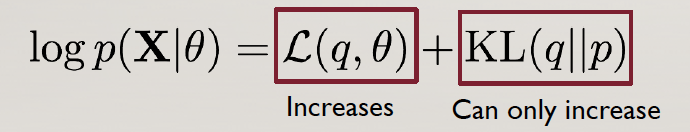

###M-step's Q-function

#### Background: Entropy and Cross-Entropy

Entropy:$H(p)=-\sum_ip(x_i)\log(p(x_i))$

Cross-entropy:$H(p)=-\sum_ip(x_i)\log(q(x_i))$

Cross-entropy measures the number of bits (or nats) is needed to identify an event from a set of possible events if the coding scheme is based on distribution q instead of the true one, p

So after E step, we made $q(Z) = p(Z|X, \theta)$, substitute this in $\mathcal{L}$, we get

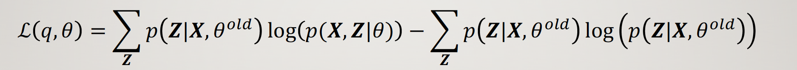

Whereby first item is negative cross entropy between $p(X,Z|\theta)$ and $p(Z|X, \theta^{old})$

Second term is constant 

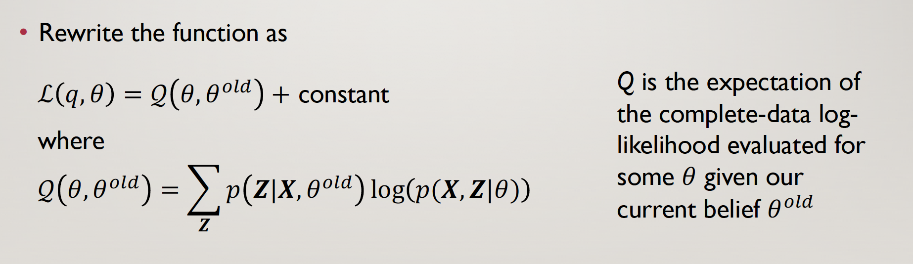

## Dimension Reduction

### Background

#### Covariance

 It is a measure of the extent to which corresponding elements from two sets of ordered data move in the same direction. Formula is shown above denoted by *cov(x,y)* as the covariance of *x* and *y*.

$cov(x, y) = \frac{\sum(x_i - \bar{x}) (y_i -\bar{y})}{N}$

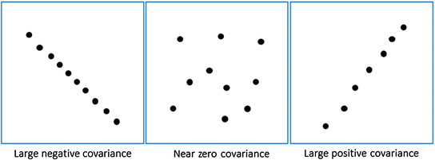

#### Eigen Value and Eigen Vector

http://setosa.io/ev/eigenvectors-and-eigenvalues/

Assume $A$ is matrix and $v$ is a vector. $Av$ Is essentially transform $v$ by applying transformation $A$. 

Then if $Av = \lambda v$ for some scalar value $\lambda$, it means transformation of $v$ by $A$ is only changing magnitude of $v$ (stretching or shrinking $ v$ while maintaining its direction).

Given a fix $A$, we can find the its eigen vectors (by selecting different $\lambda$) .

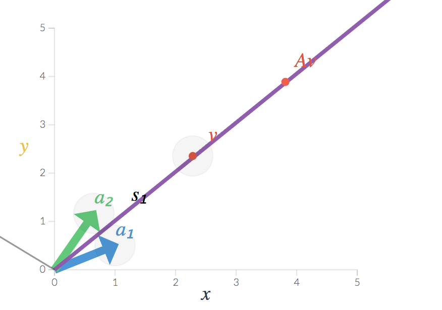

### PCA

#### Intuitions

- Firstly, What is the goal of PCA ?

  find some low independent dimension of projected data, such that the error from reconstruction of the original data error by projected data is minimised. 

- Then How to minimise reconstruction error?

  Reconstruction error is minimised when variance of projected data on each dimension is maximised. Therefore, we want to transform the original data points such that the covariance matrix of transformed data points is a diagonal matrix (zero covariance and high variance ). 

- What is Covariance Matrix? And why it should be diagonal

  We want the data to be spread out i.e. it should have high variance along dimensions. Also we want to remove correlated dimensions i.e. covariance among the dimensions should be zero (they should be linearly independent). Therefore, our covariance matrix should have -

  - large numbers as the main diagonal elements.
  - zero values as the off diagonal elements.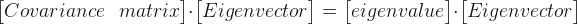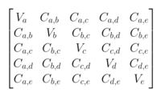

- Finally, how should we ensure that projected data's covariance matrix is diagonal?

  If we find the matrix of eigen vectors of $C_x$ and use that as $P$ ($P$ is used for transforming $X$ to $Y$, see the image below) , then $C_y$ (covariance of transformed points) will be a diagonal matrix. Hence $Y$ will be the set of new/transformed data points.

  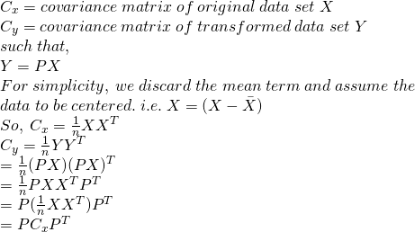

#### Process

1. Calculate the covariance matrix *X* of data points.
2. Calculate eigen vectors and corresponding eigen values.
3. Sort the eigen vectors according to their eigen values in decreasing order.
4. Choose first k eigen vectors and that will be the new k dimensions.
5. Transform the original n dimensional data points into k dimensions.

# Time Serie

## Generalised Additive Model(GAM)

The principle behind GAMs is similar to that of [regression](https://algobeans.com/2016/01/31/regression-correlation-tutorial/), except that instead of summing effects of *individual predictors*, GAMs are a sum of *smooth functions*. Functions allow us to model more complex patterns, and they can be averaged to obtain smoothed curves that are more generalizable.

### Why GAM?

- Interpretability 
- Non-parametric, avoids the pitfalls of dealing higher order polynomial terms in linear models

### Project

- FB Prophet Package
- Tesla vs. General Motor(GM)

# Data Science Stack

!

## Kafka

**Key takeaways:**

1. Kafka maintains feeds of messages in categories called topics.
2. We'll call processes that publish messages to a Kafka topic producers.
3. We'll call processes that subscribe to topics and process the feed of published messages consumers..
4. Kafka is run as a cluster comprised of one or more servers each of which is called a broker.

Communication between the clients and the servers is done with a simple, high-performance, language agnostic TCP protocol.

**Use Cases:**

1. **Messaging**: *Kafka works well as a replacement for a more traditional message broker*. In this domain Kafka is comparable to traditional messaging systems such as ActiveMQ or RabbitMQ
2. **Website Activity Tracking:** The original use case for Kafka was to be able to rebuild a user activity tracking pipeline as a set of real-time publish-subscribe feeds
3. **Metrics**: Kafka is often used for operational monitoring data, which involves aggregating statistics from distributed applications to produce centralized feeds of operational data
4. **Log Aggregation**
5. **Stream Processing**
6. **Event sourcing** is a style of application design where state changes are logged as a time-ordered sequence of records.
7. **Commit Log**: *Kafka can serve as a kind of external commit-log* for a distributed system. The log helps replicate data between nodes and acts as a re-syncing mechanism for failed nodes to restore their data

## Churn User Analyse

### Process

Overall: prediction model to predict who will be churn users in future based on data of historical churn users. 

1. Understand the problem
   - **Who should be considered as churn user**
   - Is ML the most efficient solution?  Would simple heuristic would do like a rule-based system?
   - How interpretable should the system be?
   - How the system is going to be used in future?
   - Scalability?
2. Understand data we get
   - Visualize data to get a quick sense
   - Understand statistical property of data
   - Handle missing data
   - Handle outliers
3. Choose model
   - Interpretability?
   - Time/Space Constrain?
   - Data assumption met for this model?
   - Existing researches/solutions
4. Developing
   - **Baseline system**
   - Feature Engineering
   - Training and Tuning model
5. Deploy
   - Evaluate and improve
   - **Interpret model and build insight to make suggestions to relevant stake-holders**

## AB-Testing

Essentially a **causality** test on hypothesis, which we hope can gives us a measure on Return on Investiment (ROI).  -> Randomised Control Experiment

### Process

1. we first need to form our question as a **hypothesis**, 
2. we then need to work out our **randomization strategy**, **sample size** 
3. and finally our **method of measurement**.

#### 1. Hypothesis

- Null-hypothesis: there is **NO** difference between treatment and control group
- Alternative hypothesis; there **is** difference

A hypotheis should include: **P**opulation, **I**ntervention, **C**omparison, **O**utcome, **T**ime.

E.g:

- Population: individuals who have visited the Amazon.com site
- Intervention: new website layout (Layout B)
- Comparison: visitors receiving Layout A
- Outcome: Conversion rate
- Time: End of visit to Amazon.com

#### 2. Randomization

Randomization is important 

1. to distribute co-variates evently

   - **Co-variates** are factors that might influence your outcome variable, for example, visitor geolocation, gender and risk-appetite.

2. eliminating statistical bias

   - **Randomization bias** — bias due to poor randomization resulting in *unbalanced Treatment/Control groups*.

     e.g most of our experiment participants belongs to a particular age group while we want to test the hypothesis on the whole population. 

   - **Selection bias** — bias would also result if we were to allow visitors to assign *themselves* to Treatment/Control groups .

     e.g this will happend if we allow user to select which control group they will be in. For example, visitors with more risk appetite and might select the new layout, but risk-appite people are more likely to buy our product. So in this case, we dont know whether our conversion rate increases due to the new layout because of the additional counfounder.

## SQL vs NoSQL

**The Scalability ** In most situations, SQL databases are vertically scalable, which means that you can increase the load on a single server by increasing things like CPU, RAM or SSD. NoSQL databases, on the other hand, are horizontally scalable. This means that you handle more traffic by sharding, or adding more servers in your NoSQL database. It’s like adding more floors to the same building versus adding more buildings to the neighborhood. The latter can ultimately become larger and more powerful, making NoSQL databases the preferred choice for large or ever-changing data sets.

**The Structure**SQL databases are table-based, while NoSQL databases are either document-based, key-value pairs, graph databases or wide-column stores. This makes relational SQL databases a better option for applications that require multi-row transactions - such as an accounting system - or for legacy systems that were built for a relational structure.

MySQL is a strong choice for any business that will benefit from its pre-defined structure and set schemas. For example, applications that require multi-row transactions - like accounting systems or systems that monitor inventory - or that run on legacy systems will thrive with the MySQL structure.

- NoSQL
  - **Dynamic schema:** As mentioned, this gives you flexibility to change your data schema without modifying any of your existing data.
  - **Scalability:** MongoDB is horizontally scalable, which helps reduce the workload and scale your business with ease.
  - **Manageability:** The database doesn’t require a database administrator. Since it is fairly user-friendly in this way, it can be used by both developers and administrators.
  - **Speed:** It’s high-performing for simple queries.
  - **Flexibility:** You can add new columns or fields on MongoDB without affecting existing rows or application performance.

## Machine Learning Pipline

1. Understand problem. (Metric, data, goals)
2. Data visualization
3. Data cleaning/handling missing data/identify outliers
4. Build baseline 
   1. test/dev/train split
   2. tune hyperparameter
   3. prevent overfitting
      1. cut features
      2. more data
      3. Regularization
   4. evaluate on test set
5. Fasier model

## ML Model Performance Improment

1. **More Data!** Of course! This is almost always a good idea if you can afford it. It drives variance down (without a trade-off in bias) and allows you to use more flexible models.
2. **Add More Features!** This is almost always a good idea too. Again, if you can afford it. Adding new features increases model flexibility and **decreases bias**(on the expense of variance). The only time when it’s not a good idea to add new features is when your data set is small in terms of data points and you can’t invest in #1 above.
3. **Do Feature Selection.** Well, … only do it if you have a lot of features and not enough data points. Feature selection is almost the inverse of #2 above, and pulls your model in the opposite direction (decreasing variance on the expense of some bias) but the trade-off can be good if you do the feature selection methodically and only remove noisy and in-informative features. If you have enough data, most models can automatically handle noisy and uninformative features and you don’t need to do explicit feature selection. In this day and age of “Big Data” the need for explicit feature selection rarely arises. It is also worth noting that proper feature selection is non-trivial and computationally intensive.
4. **Use Regularization.** This is the neater version of #3 and amounts to implicit feature selection. The specifics are beyond the scope for this post, but regularization tells your algorithm to try to use as few features as possible, or to not trust any single feature too much. Regularization relies on smart implementations of training algorithms and is usually the much preferred version of feature selection.
5. [Bagging](http://en.wikipedia.org/wiki/Bootstrap_aggregating) is short for Bootstrap Aggregation. It uses several versions of the same model trained on slightly different samples of the training data to reduce variance without any noticeable effect on bias. Bagging could be computationally intensive esp. in terms of memory.
6. [Boosting](http://en.wikipedia.org/wiki/Boosting_%28machine_learning%29) is a slightly more complicated concept and relies on training several models successively each trying to learn from the errors of the models preceding it. Boosting decreases bias and hardly affects variance (unless you are very sloppy). Again the price is computation time and memory size.
7. **Use a more different class of models!** Of course you don’t have to do all the above if there is another type of models that is more suitable to your data set out-of-the-box. Changing the model class (e.g. from linear model to neural network) moves you to a different point in the space above. Some algorithms are just better suited to some data sets than others. Identifying the right type of models could be really tricky though!